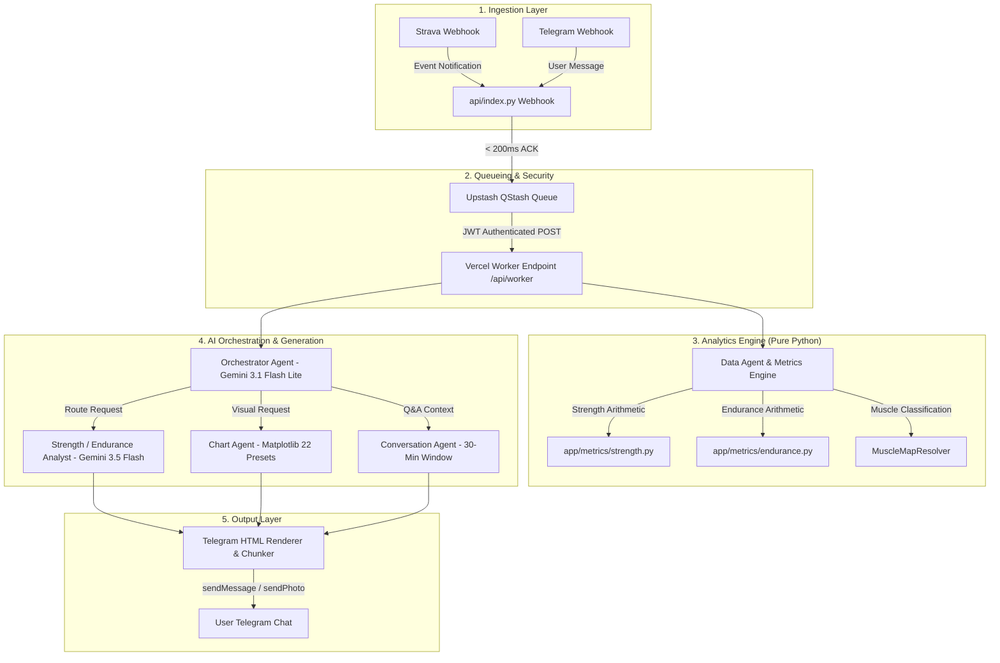

# ? PulseFit AI

[](https://www.python.org/downloads/)
[](https://aistudio.google.com/)
[](https://neon.tech)
[](https://upstash.com)
[](https://vercel.com)
[](https://docs.pytest.org/)

**PulseFit AI** is an autonomous, personal AI fitness intelligence agent and Telegram companion. It monitors completed workouts (weight training & endurance running) via Strava webhooks, computes deep mathematical analytics within ~60 seconds, delivers unprompted analytical briefings on Telegram, and holds a 30-minute interactive conversation to answer questions, compare training history, or chart performance trends.

---

## ?? Key Architectural Highlights

- **Zero-LLM Math Isolation**: All arithmetic (tonnage, e1RM, fatigue drop-offs, LTHR zones, aerobic decoupling, ACWR workload ratios) is computed in pure, unit-tested Python. Google Gemini strictly interprets pre-calculated metrics into actionable coaching prose.
- **Single Source of Truth (Strava + Hevy Parser)**: Weight training sets are parsed directly from Strava's activity descriptions (as written by Hevy exports), eliminating paid API dependencies.
- **Dynamic 3-Tier Muscle Mapping**: Resolves exercise names using a local static table, learned PostgreSQL history, and zero-shot Gemini classification for unmapped movements.
- **Asynchronous Queue Architecture**: Sub-second webhook acknowledgements (<200ms) with event processing handled via Upstash QStash and Vercel background workers.

---

## ??? Architecture & Pipeline Workflow



---

## ?? Quick Setup & Installation

### 1. Prerequisites
- **Python 3.12+** & **uv** (or standard `venv`)
- Credentials from **Telegram** (`@BotFather`), **Strava API**, **Google Gemini API**, **PostgreSQL** (Neon/Supabase), and **Upstash (Redis + QStash)**.

### 2. Clone & Install Environment
```bash
git clone https://github.com/nachiket0987/pulsefit-ai.git
cd pulsefit-ai

# Create Python 3.12 environment using uv
uv venv --python 3.12
source .venv/bin/activate    # On Windows: .venv\Scripts\activate

# Install dependencies
uv pip install -r requirements.txt
pytest -q                     # Run unit test suite (199 passed)
```

### 3. Environment Setup
Fill out `.env` with your API credentials:
```bash
cp .env.example .env   # Or edit the generated .env file
```

Auto-generate secret keys:
```bash
python -c "from cryptography.fernet import Fernet; print(Fernet.generate_key().decode())"   # -> ENCRYPTION_KEY
python -c "import secrets; print(secrets.token_hex(32))"                                     # -> INTERNAL_API_SECRET
```

### 4. Database Migration & Webhook Binding
```bash
# Apply SQL Schema
python -c "from pathlib import Path; from app.config import get_settings; from app.storage.db import Database; Database(get_settings().database_url).apply_migrations(Path('migrations'))"

# Authenticate Strava OAuth & Webhooks
python scripts/bootstrap_oauth.py
python scripts/setup_strava_webhook.py create
python scripts/setup_telegram_webhook.py set
```

---

## ?? Deploying to Vercel

```bash
npm i -g vercel
vercel login
vercel                       # Deploy preview
vercel env add               # Bulk add .env keys to Vercel production
vercel --prod                # Production release
```

---

## ?? Supported Telegram Commands

| Command | Purpose |
|---|---|
| `/start` | Welcome & onboarding guide |
| `/last` | Resends the most recent workout briefing |
| `/week` | Displays summary for trailing 7 days |
| `/pr` | Queries personal records for specific exercises |
| `/chart` | Generates visual charts for exercise progress |
| `/compare` | Historical workout comparison |
| `/profile` | Views/updates training goals and physiology metrics |
| `/forget` | Clears active 30-minute session memory |

---

## ?? Author & Maintainer

**Nachiket Gadilohar**
- **Email**: [nachiketlohar0306@gmail.com](mailto:nachiketlohar0306@gmail.com)
- **GitHub**: [@nachiket0987](https://github.com/nachiket0987)
- **LinkedIn**: [linkedin.com/in/nachiket-gadilohar-profile](https://linkedin.com/in/nachiket-gadilohar-profile/)

---

## ?? License
Project developed for personal use and open portfolio demonstration.
