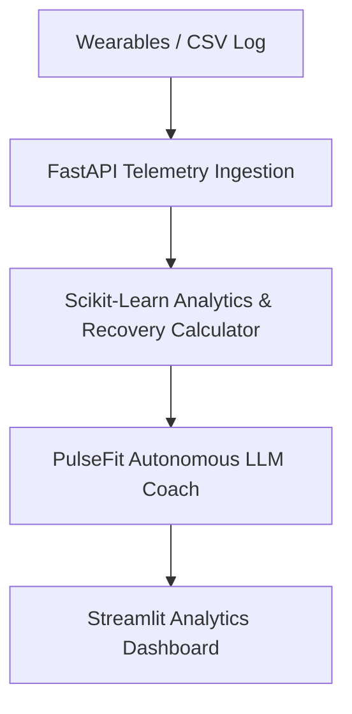

# System Architecture Document — PulseFit AI

**Project Name:** PulseFit AI  
**Author:** Nachiket Gadilohar  

---

## 1. Architecture Overview

### Component Details:
- **Backend API**: FastAPI, Python 3.10.
- **Analytics & ML**: Pandas, NumPy, Scikit-Learn, SciPy.
- **AI Agent**: LangChain / OpenAI GPT-4o.
- **Frontend**: Streamlit / React UI.
